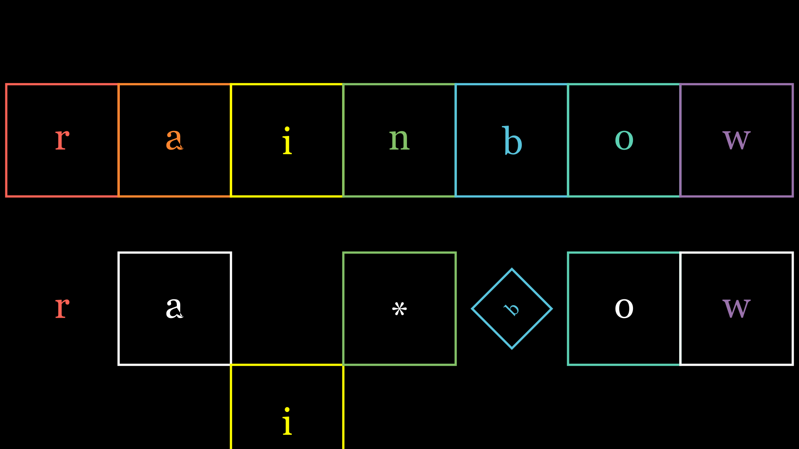
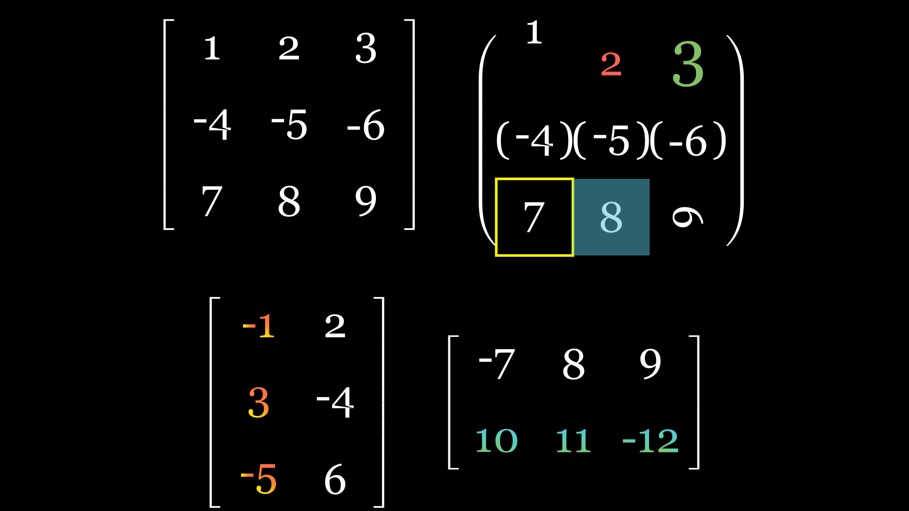

# rainbow_yu🐋✨  
Improvements and additions to animation control and operations based on Manim.  
For basic Manim knowledge, please refer to [manim](https://github.com/manimCommunity/manim)

language: [English](README.md)   [Chinese](README-ch.md)
---

### Installation:
```bash
git clone https://github.com/rainbowyuyu/manim_extend_rainbow
cd ./manim_extend_rainbow
pip install -r requirements.txt
```

---

### File Structure:  
yty_manim  
├── [examples.ipynb](examples/examples.ipynb)  
├── [disposition](yty_manim%2Fdisposition)  
│ ├── [speed_rate_fuc.py](yty_manim%2Fdisposition%2Fspeed_rate_fuc.py)  
│ └── [fonts_and_colors.py](yty_manim%2Fdisposition%2Ffonts_and_colors.py)  
├── [basic_unit](yty_manim%2Fbasic_unit)  
│ ├── [squ_tex.py](yty_manim%2Fbasic_unit%2Fsqu_tex.py)  
│ ├── [dec_bin.py](yty_manim%2Fbasic_unit%2Fdec_bin.py)  
│ ├── [screen_cycle.py](yty_manim%2Fbasic_unit%2Fscreen_cycle.py)  
│ └── [threed_vgp.py](yty_manim%2Fbasic_unit%2Fthreed_vgp.py)  
└── [application](yty_manim%2Fapplication)  
  ├── [matrix_yty.py](yty_manim%2Fapplication%2Fmatrix_yty.py)  
  └── [page_replacement.py](yty_manim%2Fapplication%2Fpage_replacement.py)

---

## basic_unit

---

### squ_tex.py
Contains two classes: `SquTex` and `SquTexSlide`



---

#### SquTex

A data block, inheriting from :class:`~.VGroup`,  
- Commonly used for demonstrations of data structures and binary encoding,  
- Combines squares and numbers together, supporting unified and individual animations,  
- The `distance` member records the gap between data when first constructed,  
- Single animations can be created using :method:`animate_one_by_one` to group animations,  
- When creating the data block, all modifiable parameters are passed to the :class:`~.Square` class,  
- To modify other parameters, use :method:`change_square` and :method:`change_text`,  
- Be cautious when using :method:`change_text`, as it will change the hierarchy of the original object,  
- Use :method:`add_bracket` to add brackets to all negative numbers in the data block.

Usage example:

```python
from manim import *
from yty_manim.basic_unit.squ_tex import SquTex

class SquTexCreate(Scene):
    def construct(self):
        t = SquTex("rainbow")
        self.play(t.animate_one_by_one(FadeIn , scale=1.5))
        self.wait()
```

---

#### SquTexSlide

A sliding data block, inheriting from :class:`~.SquTex`,  
- Adds sliding animation to the data block,  
- Use :method:`slide` for basic positional sliding,  
- Use :method:`slide_fade` for internal or external sliding with smooth fade-in and fade-out for the data block.

Usage example:

```python
from manim import *
from yty_manim.basic_unit.squ_tex import SquTexSlide

class SquTexSlideBasic(Scene):
    def construct(self):
        s = SquTexSlide("rainbow")
        self.add(s)
        self.wait()
        for i in range(len(s)):
            self.play(*s.slide(-1))
        self.wait()
```

---

### dec_bin.py
Contains a class `BinNumber`  
- Currently no interfaces for other animations, improvements planned during the winter break.

---

#### BinNumber

A data block for binary numbers,  
- Records the sign bit, integer part, and fractional part of a binary number,  
- Converts decimal numbers to an ideal binary format,  
- Can perform operations on binary numbers.

- Initialize with empty values for the object, then use :method:`bin2dec` to convert the binary object to a decimal number,  
- Use :method:`standardize` to standardize the binary number format,  
- Use :method:`ex_one` to convert to its one's complement,  
- Use :method:`ex_two` to convert to its two's complement,  
- Use :method:`information` to display all parameter information,  
- Use :method:`cal_check` to check if precision will be exceeded during calculations,  
- Operator overloading methods follow the format of the first operand.

Usage example:

```python
from yty_manim.basic_unit.dec_bin import BinNumber

# Define decimal number and convert it to binary
test_bin = BinNumber(-0.2, 8, 1, True)
print(test_bin)
print(test_bin.ex_one())
print(test_bin.ex_two())
```

---

## application

---

### matrix_yty.py
Contains base class `MatrixCal` and actual computations `MatrixDet` and `MatrixMath`



---

#### MatrixCal
A matrix class for absolute control of matrix elements, inheriting from :class:`~.VGroup`,  
- Commonly used for demonstrating matrix computations,  
- Supports generating matrices with negative numbers and brackets using :method:`neg_with_brackets`,  
- Get matrix rows using :method:`get_row`,  
- Get matrix columns using :method:`get_column`.

---

#### MatrixDet
Determinant calculation, inheriting from :class:`~.MatrixCal`,  
- Commonly used for demonstrating determinant calculations,  
- Supports extended determinant calculation demonstrations using :method:`det_mat`,  
- Automatically adjusts size using :method:`set_scale_fitness`,  
- Get calculation process information using :method:`get_process_inform`,  
- Get result information using :method:`get_result_inform`,  
- Generate calculation steps using :method:`cal_progress_times`,  
- Generate result steps using :method:`cal_result_addition`.

---

#### MatrixMath
Matrix operations, inheriting from :class:`~.MatrixCal`,  
- Used for demonstrating matrix operations,  
- Supports extended matrix operation demonstrations using :method:`det_mat`,  
- Automatically adjusts size using :method:`set_scale_fitness`,  
- Get operation process information using :method:`get_process_inform`,  
- Get result information using :method:`get_result_inform`,  
- Generate operation steps using :method:`cal_progress_times`,  
- Generate result steps using :method:`cal_result_addition`.