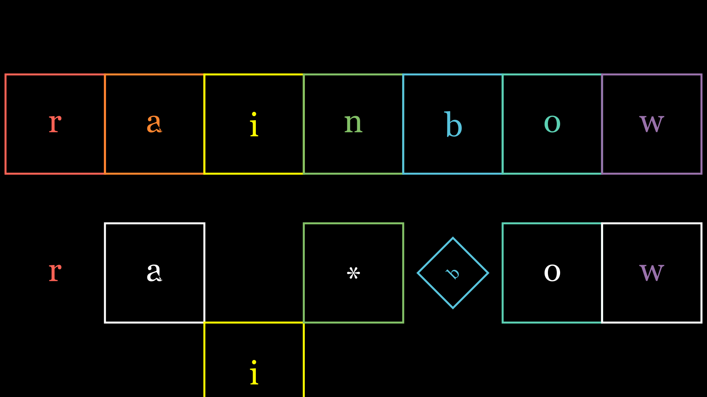
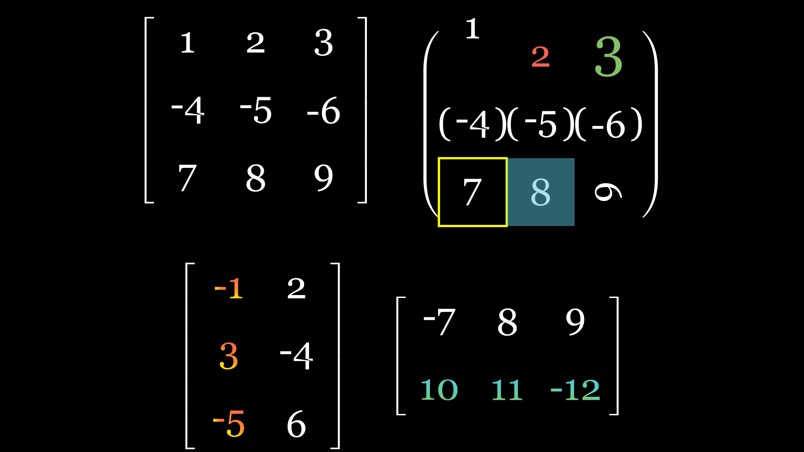

# rainbow_yu🐋✨
在manim基础上进行的动画控制和运算的改进或添加，
基础的manim知识请参考[manim](https://github.com/manimCommunity/manim)

---

使用方法：
```bash
git clone https://github.com/rainbowyuyu/manim_extend_rainbow
cd ./manim_extend_rainbow
pip install -r requirements.txt
```

---

文件结构：  
manim_extend_rainbow  
├──examples.ipynb   
├──disposition  
│ └── fonts_and_colors.py  
├──basic_unit  
│ ├── squ_tex.py  
│ ├── dec_bin.py  
│ └── threed_vgp.py  
└── application  
  ├── matrix_yty.py  
  └── page_replacement.py

---

# basic_unit

---

## squ_tex.py
包含两个类 `SquTex` 和 `SquTexSlide`



---

### SquTex

数据块， 继承于 :class:`~.VGroup` ，
- 常用于数据结构的演示和二进制编码的演示，
- 将方块和数字整合在一起，支持统一的动画和单个动画，
- :param:`distance` 成员记录了第一次构造数据间的间距
- 单个动画使用 :method:`animate_one_by_one` 将动画编为一个组
- 在创建数据块时，把所有的可变参数 kwargs 赋给了 :class:`~.Square` 类。
- 如果需要改变其他参数，使用 :method:`change_square` 以及 :method:`change_text`，
- 但要注意使用 :method:`change_text` 时会将原对象的层次改变。
- 使用 :method:`add_bracket` 将数据块中所有负数的数字都加上括号

使用示例：

```python
from manim import *
from yty_manim.basic_unit.squ_tex import SquTex

class SquTexCreate(Scene):
    def construct(self):
        t = SquTex("rainbow")
        self.play(t.animate_one_by_one(FadeIn , scale=1.5))
        self.wait()
```

---

### SquTexSlide

演示滑动的数据块， 继承于 :class:`~.SquTex` ，
- 在数据块的基础上添加滑动的动画，
- 使用 :method:`slide` 做基本的位置变化滑动
- 使用 :method:`slide_fade` 做数据块内部或外部添加的循环滑动，并且头尾缓入缓出

使用示例：

```python
from manim import *
from yty_manim.basic_unit.squ_tex import SquTexSlide

class SquTexSlideBasic(Scene):
    def construct(self):
        s = SquTexSlide("rainbow")
        self.add(s)
        self.wait()
        for i in range(len(s)):
            self.play(*s.slide(-1))
        self.wait()
```

---

## dec_bin.py
包含一个类 `BinNumber`
- 目前还没留和其他动画的接口，寒假完善

---

### BinNumber

数据块中二进制数
通过记录二进制数的符号位，整数部分，小数部分，
将十进制数转换为理想的二进制数格式，
并且能对二进制数进行一些处理，

- 先用空值对类对象进行赋值，输入 bin_num 后使用 :method:`bin2dec` 将二进制数类对象转化为一个十进制数，
- 使用 :method:`standardize` 将二进制数类对象进行格式标准化，
- 使用 :method:`ex_one` 将二进制数类对象转化为其反码，
- 使用 :method:`ex_two` 将二进制数类对象转化为其补码，
- 使用 :method:`information` 显示该二进制数的所有参数信息，
- 使用 :method:`cal_check` 检验在算法运算时是否会超出精度，
- 使用计算方法重载时，格式跟随第一目继承。

使用示例：

```python
from yty_manim.basic_unit.dec_bin import BinNumber

#定义十进制数转换二进制数
test_bin = BinNumber(-0.2, 8, 1, True)
print(test_bin)
print(test_bin.ex_one())
print(test_bin.ex_two())
```

---

# application

---

## matrix_yty.py
包含基类 `MatrixCal` 和 实际计算 `MatrixDet` 和 `MatrixMath`



---
### MatrixCal
可绝对控制元素的矩阵类， 继承于 :class:`~.VGroup` ，

- 常用于矩阵计算的演示
- 支持生成负数带括号的矩阵 :method:`neg_with_brackets`
- 获取矩阵行 :method:`get_row`
- 获取矩阵列 :method:`get_column`

---
### MatrixDet
行列式计算， 继承于 :class:`~.MatrixCal` ，

- 常用于行列式计算的演示，
- 支持扩展成计算演示的行列式 :method:`det_mat`，
- 自适应大小 :method:`set_scale_fitness`，
- 获取计算过程信息 :method:`get_process_inform`，
- 获取结果信息 :method:`get_result_inform`，
- 计算过程组 :method:`cal_progress_times`，
- 计算结果组 :method:`cal_result_addition`，

---
### MatrixMath
行列式计算， 继承于 :class:`~.MatrixCal` ，

- 常用于行列式计算的演示，
- 支持扩展成计算演示的行列式 :method:`det_mat`，
- 自适应大小 :method:`set_scale_fitness`，
- 获取计算过程信息 :method:`get_process_inform`，
- 获取结果信息 :method:`get_result_inform`，
- 计算过程组 :method:`cal_progress_times`，
- 计算结果组 :method:`cal_result_addition`，